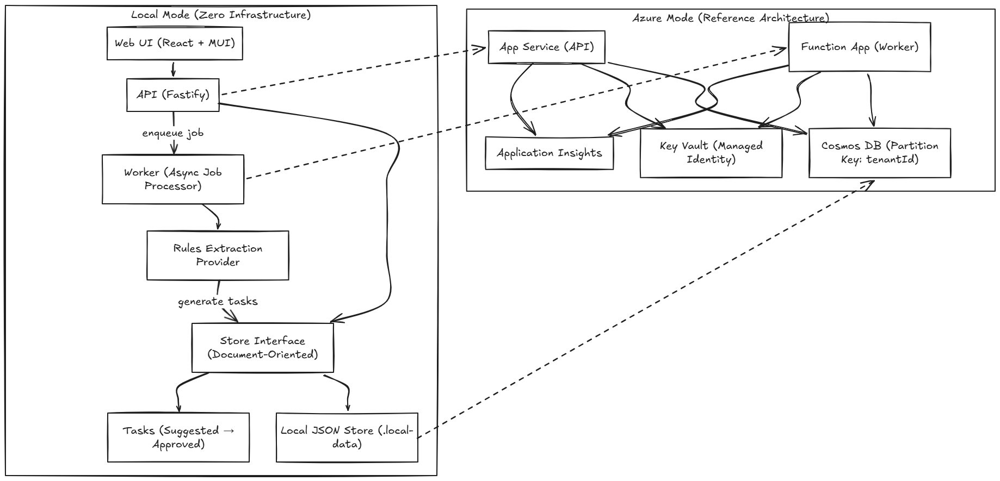

# meeting-action-extractor


Local-first, multi-tenant reference implementation for extracting structured action items from meeting notes.

This repository demonstrates:

- Strict tenant isolation (partition key = tenantId)
- Document-oriented schema aligned with Cosmos DB
- Async processing pipeline (API → Job → Worker → Extraction → Tasks)
- Deterministic extraction provider (rules-based, testable)
- Zero-infrastructure Local Mode
- Azure reference architecture (Managed Identity + Key Vault)
- Architecture Decision Records (ADRs)
- CI-enforced quality gates

Local Mode runs fully offline with no cloud dependencies.

## Architecture Overview



## Quick Demo (< 10 minutes)

From repo root:

```bash
pnpm install
pnpm store:seed
```

Run in separate terminals:

```bash
# Terminal 1
cd apps/api
pnpm dev
```

```bash
# Terminal 2
cd apps/worker
pnpm dev
```

```bash
# Terminal 3
cd apps/web
pnpm dev
```

Minimal path (without long-running worker):

```bash
# Terminal 1
cd apps/api
pnpm dev
```

```bash
# Terminal 2 (run once after submitting a note)
pnpm worker:once
```

```bash
# Terminal 3
cd apps/web
pnpm dev
```

Dev Context values in web UI:

- Tenant ID: `tenant-demo`
- User ID: `user-admin-demo`
- Email: `admin@demo.local`
- Roles: `admin,member`
- Allow Delete Notes (feature flag): enabled (for controlled delete demo)

Sample note:

```
Meeting: Weekly Team Sync - Feb 16, 2026

Action Items:
ACTION: Hank to provide development plan by Friday
ACTION: Ira to complete Q1 metrics report due 2026-02-20
NEXT: Schedule follow-up meeting @Sarah
FOLLOW UP: Review performance improvement plan with HR
- Set up mentorship sessions for Ira
- Document quarterly objectives
```

## Azure Mode (Reference)

Azure Mode is documentation + IaC skeleton only. It is designed for architecture reviews and deployment planning.

- Architecture mapping: [docs/architecture/local-vs-azure.md](docs/architecture/local-vs-azure.md)
- Azure reference topology: [docs/architecture/azure-reference-architecture.md](docs/architecture/azure-reference-architecture.md)
- ADR index: [docs/architecture/adr_readme.md](docs/architecture/adr_readme.md)
- Observability + feature flags: [docs/architecture/observability-feature-flags.md](docs/architecture/observability-feature-flags.md)
- IaC skeleton: [infra/azure](infra/azure)
- Azure deployment notes: [infra/azure/README.md](infra/azure/README.md)

Local Mode remains the default and requires **no cloud setup** for lint, typecheck, tests, or demo walkthroughs.

## Quick Start

### 1. Install Dependencies

```bash
pnpm install
```

### 2. Seed Local Data

```bash
pnpm store:seed
```

This creates a demo tenant with admin and member users in `.local-data/store.json`.

### 3. Run the Application

Open **three terminals** and run:

**Terminal 1 - API Server:**
```bash
cd apps/api
pnpm dev
```
API runs at `http://localhost:3000`

**Terminal 2 - Worker (Task Extraction):**
```bash
cd apps/worker
pnpm dev
```
Worker polls for jobs every few seconds

**Terminal 3 - Web UI:**
```bash
cd apps/web
pnpm dev
```
Web UI runs at `http://localhost:5173`

### 4. Open the Web UI

1. Navigate to `http://localhost:5173`
2. Expand the **Dev Auth Context** panel at the top
3. Enter demo credentials:
     - **Tenant ID:** `tenant-demo`
     - **User ID:** `user-admin-demo`
   - **Email:** `admin@demo.local`
   - **Roles:** `admin,member`

### 5. Submit a Test Note

Click **"New Note"** and paste this sample:

```
Meeting: Weekly Team Sync - Feb 16, 2026

Attendees: @Hank (Manager), @Ira (Employee)

Discussion Points:
- Q1 Performance Review
- Development opportunities

Action Items:
ACTION: Hank to provide development plan by Friday
ACTION: Ira to complete Q1 metrics report due 2026-02-20
NEXT: Schedule follow-up meeting @Sarah
FOLLOW UP: Review performance improvement plan with HR

Additional tasks:
- Set up mentorship sessions for Ira
- Document quarterly objectives
```

The worker will automatically extract **6 tasks** from this note within a few seconds!

### 6. Review Extracted Tasks

- Tasks appear automatically (page polls every 3 seconds while processing)
- Click **Approve**, **Reject**, or **Edit** for each task
- Export approved tasks as CSV

## Project Structure

- `apps/api` — Fastify REST API with tenant auth + RBAC
- `apps/worker` — Background job processor with rules-based extraction
- `apps/web` — React + MUI web interface
- `packages/db` — File-backed local store (tenant-isolated)
- `packages/extractor` — Rules-based task extraction engine
- `packages/shared` — Shared types/utilities
- `infra/local` — Local infrastructure placeholders
- `infra/azure` — Azure reference IaC skeleton

## How Task Extraction Works

The rules-based extractor looks for:

**Keywords:**
- `ACTION:`
- `NEXT:`
- `FOLLOW UP:`
- Additional explicit task prefixes supported by the extractor

**Heuristics:**
- Bullet points starting with action verbs (e.g., "Schedule", "Review", "Complete")

**Metadata Parsing:**
- Owners: `@Name` or `Owner: Name`
- Due Dates: `YYYY-MM-DD` format

## Modes

### Local Mode (Current)

Local development runs offline without Azure dependencies.

- File-backed store at `.local-data/store.json`
- Deterministic seed data for demo tenant
- Tenant-scoped reads and writes
- Job queue for worker processing

### Azure Mode (Reference)

Azure mode is a reference architecture (not implemented yet).
Target: App Service + Functions + Key Vault + Managed Identity.

## Development Commands

From project root:

```bash
pnpm store:seed      # Seed local data
pnpm dev             # Start API only
pnpm dev:worker      # Start worker only (from repo root)
pnpm dev:web         # Start web UI only (from repo root)
pnpm worker:once     # Run worker once (manual)
pnpm test            # Run all tests
pnpm lint            # Lint all packages
pnpm typecheck       # Type check all packages
```

## API Details

### Authentication Headers

Request headers for auth context:

- `x-tenant-id` — Tenant identifier
- `x-user-id` — User identifier
- `x-user-email` — User email
- `x-user-roles` — Comma-separated roles: `admin`, `member`, `reader`
- `x-feature-flags` — Local feature overrides (example: `notes.allowDelete=true`)

These headers are **development-mode only** and used for local demo auth context.

**Development mode:** Falls back to demo context if headers missing  
**Production mode:** Returns `401` if headers missing

### API Endpoints

- `GET /health` — Health check
- `GET /me` — Current user context
- `GET /notes` — List notes
- `POST /notes` — Create note (member+)
- `GET /notes/:id` — Get note details
- `DELETE /notes/:id` — Delete note and related tasks/jobs (admin + `notes.allowDelete=true`)
- `GET /notes/:id/tasks` — Get tasks for note
- `PATCH /tasks/:id` — Update task (member+)
- `GET /tasks/export.csv?status=approved` — Export CSV

### Example curl Commands

**Health check:**
```bash
curl -H "x-tenant-id: tenant-demo" \
     -H "x-user-id: user-admin-demo" \
     -H "x-user-email: admin@demo.local" \
     -H "x-user-roles: admin" \
     http://localhost:3000/health
```

**Create note:**
```bash
curl -X POST http://localhost:3000/notes \
     -H "content-type: application/json" \
     -H "x-tenant-id: tenant-demo" \
     -H "x-user-id: user-member-demo" \
     -H "x-user-email: member@demo.local" \
     -H "x-user-roles: member" \
     -d '{"title":"Weekly Sync","rawText":"ACTION: Review budget\nNEXT: Submit report"}'
```

**Export tasks as CSV:**
```bash
curl -H "x-tenant-id: tenant-demo" \
     -H "x-user-id: user-member-demo" \
     -H "x-user-email: member@demo.local" \
     -H "x-user-roles: member" \
     "http://localhost:3000/tasks/export.csv?status=approved"
```

## Observability

OpenTelemetry tracing is enabled for API and worker via shared initialization.

- Default local exporter: console
- Optional OTLP exporter: set `OTEL_EXPORTER=otlp` and `OTEL_EXPORTER_OTLP_ENDPOINT`
- Key attributes: `tenantId`, `userId`, `requestId`, `jobId`, `noteId`

Environment variables:

- `OTEL_EXPORTER_OTLP_ENDPOINT`
- `OTEL_EXPORTER` (`otlp` or `console`)
- `OTEL_TRACES_SAMPLER`
- `OTEL_RESOURCE_ATTRIBUTES`

## Feature Flags

Flag evaluation priority:

1. `x-feature-flags` header (non-production only)
2. `FEATURE_*` environment variables
3. Hardcoded defaults

Implemented flags:

- `telemetry.enabled` (default `true`)
- `extractor.provider` (default `rules`)
- `notes.allowDelete` (default `false`)
- `ui.devContextPanel` (default `true` in local)

Controlled delete behavior:

- `DELETE /notes/:id` is available only for admins when `notes.allowDelete=true`
- If the delete flag is disabled, endpoint returns `404`
- Delete removes the note plus tenant-scoped related tasks/jobs and writes `note_deleted` audit event

## Security & Best Practices

### No Secrets Policy

- Never commit secrets, keys, tokens, or connection strings
- Use `.env.example` for placeholders only
- Azure mode must use Managed Identity + Key Vault

### Tenant Isolation

- Every record includes `tenantId`
- Every query filters by `tenantId`
- Cross-tenant access is prevented at the data layer

### RBAC (Role-Based Access Control)

**Roles:**
- `admin` — Manage tenant members + all member permissions
- `member` — Create notes, review/approve/edit tasks
- `reader` — View-only access

## Local Store and Azure Cosmos Mapping

The local store is intentionally simple so tests run without network access.

**Conceptual mapping to Cosmos DB for Azure mode:**
- Tenant isolation key: `tenantId`
- Recommended partition key: `/tenantId`
- All entities modeled with tenant ownership first

This keeps query patterns aligned with multi-tenant isolation and minimizes cross-partition access.

